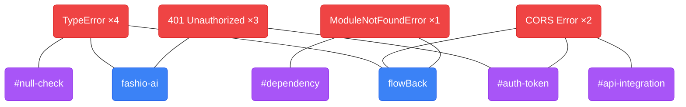

# FlowBack

Pick up exactly where you left off. FlowBack scans your recently modified files, sends them to Gemini AI, and gives you a focused briefing when you sit back down — per project, with error tracking and skill gap visualization.

---

## What it does

| Feature | Description |
|---|---|
| **Pause & Resume** | Save your coding context before a break, get a per-project AI briefing when you return |
| **Error tracking** | Paste an error, get root cause + fix steps, see how many times you've hit the same issue |
| **Force graph** | Visual map of errors across projects and skill areas — identify patterns and knowledge gaps |
| **Tags** | Auto-generated skill labels (e.g. `#auth-token`, `#file-upload`) that track across sessions |

---

## Two ways to use it

### Option 1 — Terminal (CLI)

```bash
# Save context before stepping away
flowback pause ~/projects/myapp ~/projects/other

# Resume when you're back
flowback resume

# Track an error
flowback error "TypeError: Cannot read properties of undefined"

# Or pipe directly from a command
npm run build 2>&1 | flowback error

# See all tracked errors with counts
flowback errors

# See recurring tags / skill gaps
flowback tags
```

### Option 2 — Web UI (localhost)

Open `http://localhost:5173` in your browser:

- **Pause tab** — add project folders, click *Save my context*
- **Resume tab** — per-project AI briefings with goal, stuck point, next steps, and clickable tags
- **Graph tab** — force-directed graph of errors, projects, and skill tags

---

## Setup

### 1. Clone the repo

```bash
git clone https://github.com/gitkkarthik/FlowBack.git
cd FlowBack
```

### 2. Get a Gemini API key

Get a free key at [aistudio.google.com](https://aistudio.google.com/app/apikey).

### 3. Set up the backend

```bash
cd backend
python3 -m venv .venv
source .venv/bin/activate        # Windows: .venv\Scripts\activate
pip install -r requirements.txt
```

Create `backend/.env`:

```
GEMINI_API_KEY=your_key_here
```

Start the server:

```bash
uvicorn main:app --reload
```

API runs at `http://localhost:8000`.

### 4. Set up the frontend

```bash
cd frontend
npm install
npm run dev
```

UI runs at `http://localhost:5173`.

### 5. (Optional) Install the CLI

To use `flowback` from any terminal, install the package from the repo root:

```bash
pip install -e .
```

Create `~/.flowback/.env` with your API key:

```
GEMINI_API_KEY=your_key_here
```

Then use it from anywhere:

```bash
flowback pause ~/projects/myapp
flowback resume
flowback error "your error here"
```

---

## Project structure

```
FlowBack/
├── flowback/                   # Core Python package (shared by CLI + backend)
│   ├── capture.py              # File scanner
│   ├── database.py             # SQLite helpers (~/.flowback/history.db)
│   ├── gemini.py               # Gemini AI integration
│   ├── models.py               # Pydantic models
│   └── cli.py                  # CLI entry point (flowback command)
├── backend/
│   ├── main.py                 # FastAPI server
│   └── requirements.txt
├── frontend/
│   └── src/
│       ├── App.jsx
│       └── components/
│           ├── PauseScreen.jsx
│           ├── ResumeScreen.jsx
│           ├── BriefingCard.jsx
│           ├── TagPanel.jsx
│           └── ErrorGraph.jsx  # Force graph visualization
├── pyproject.toml              # CLI package config
└── setup.py
```

---

## Reading the Error Graph

The Graph tab shows a force-directed map of every error you've tracked, which projects they appeared in, and which skill areas they touch.

**Sample graph**



> `TypeError` is connected to **both projects** → cross-cutting knowledge gap, not project-specific.
> `#auth-token` is shared by two errors → auth is a skill area to strengthen.

**Node types**

| Color | Type | What it represents |
|---|---|---|
| 🔴 Red | Error | A unique error type (e.g. `TypeError`, `401 Unauthorized`). Size = how many times you've hit it. |
| 🔵 Blue | Project | A project folder where errors occurred (e.g. `fashio-ai`, `flowBack`). |
| 🟣 Purple | Skill tag | A skill area extracted from the error (e.g. `#auth-token`, `#null-check`, `#file-upload`). Size = how often this skill area is involved. |

**How to read it**

- A **large red node** = an error you keep hitting — highest priority to fix properly.
- A **large purple node** with many red nodes pointing to it = a skill gap. That tag represents an area worth studying.
- A **red node connected to multiple blue project nodes** = a cross-cutting problem that isn't specific to one project — a fundamental knowledge gap.
- **Isolated red nodes** = one-off issues, less concerning.
- **Hover over any node** to see details: error type, root cause, and occurrence count.

**How to populate it**

The graph is empty until you track errors. Run `flowback error` from inside your project directories — the project is auto-detected from your current folder:

```bash
cd ~/projects/myapp
flowback error "TypeError: Cannot read properties of undefined"

# Or pipe output directly
npm run build 2>&1 | flowback error
python manage.py migrate 2>&1 | flowback error
```

Over time the graph builds up a picture of your recurring weak spots across all your projects.

---

## Notes

- All data stays local — nothing leaves your machine except file snippets sent to Gemini.
- Scans up to 5 recently modified files per folder (last 2 hours), skipping binaries, `node_modules`, `.git`, build output, and other noise.
- The **Choose folder** button in the UI requires macOS (uses `osascript`). On other platforms, type the path manually.
- Data is stored at `~/.flowback/history.db` — shared between the CLI and the web UI.
