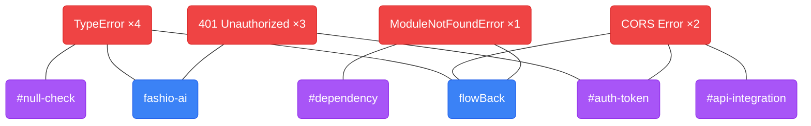

# FlowBack

Pick up exactly where you left off. Before you step away from your code, run one command. When you come back, run another. FlowBack scans your recently modified files, sends them to Gemini AI, and hands you a focused briefing — per project, with error tracking and skill gap visualization.

---

## Install

```bash
# Clone the repo
git clone https://github.com/gitkkarthik/FlowBack.git
cd FlowBack

# Install the CLI
pip install -e .
```

Get a free Gemini API key at [aistudio.google.com](https://aistudio.google.com/app/apikey), then create `~/.flowback/.env`:

```
GEMINI_API_KEY=your_key_here
```

That's it. No server to run. Works from any terminal.

---

## Usage

### Save context before stepping away

```bash
flowback pause ~/projects/myapp
flowback pause ~/projects/myapp ~/projects/other   # multiple projects
flowback pause ~/projects/myapp --note "debugging auth middleware"
```

### Resume when you're back

```bash
flowback resume          # latest session
flowback resume --all    # all past sessions
```

Each project gets its own briefing: **your goal**, **where you were stuck**, **next 3 steps**, and **auto-generated skill tags**.

### Track errors

```bash
# Paste an error
flowback error "TypeError: Cannot read properties of undefined"

# Or pipe directly from a command
npm run build 2>&1 | flowback error
python manage.py migrate 2>&1 | flowback error

# See all tracked errors with counts
flowback errors
```

First time → root cause + fix steps. Third time hitting the same error → **"break the loop"** advice tailored to your specific recurring pattern.

### See skill gaps as a graph

```bash
flowback graph
```

Opens a force-directed graph in your browser (no server needed — generates a local HTML file). Shows which errors keep coming back, which projects they span, and which skill areas to strengthen.

### Browse recurring tags

```bash
flowback tags
```

---

## How the graph works



> `TypeError` is connected to **both projects** → cross-cutting knowledge gap, not project-specific.
> `#auth-token` is shared by two errors → auth is a skill area to strengthen.

| Color | Type | What it represents |
|---|---|---|
| 🔴 Red | Error | A unique error type. Size = how many times you've hit it. |
| 🔵 Blue | Project | A project where errors occurred. |
| 🟣 Purple | Skill tag | A skill area extracted from the error. Size = how often it's involved. |

**How to read it**
- Large red node = error you keep hitting — fix it properly
- Large purple node with many connections = skill gap worth studying
- Red node connected to multiple blue nodes = cross-cutting knowledge gap, not project-specific

---

## Stack

- **Python** — CLI, file scanning, SQLite
- **Google Gemini 2.5 Flash** — AI briefings, error analysis, tag generation
- **Typer + Rich** — CLI interface
- **force-graph.js** — graph visualization (embedded in generated HTML)

---

## Claude Code — MCP Integration

Connect FlowBack directly to Claude Code so your context, errors, and skill gaps are available as Claude tools — no commands to remember.

### Setup

```bash
# 1. Install (if not done already)
pip install -e .

# 2. Register with Claude Code
claude mcp add flowback flowback-mcp
```

### Tools available inside Claude

| Tool | What it does |
|---|---|
| `pause` | Scan project folders and save your context |
| `resume` | Get your last briefing — what you were working on and what to do next |
| `track_error` | Analyze an error, get root cause + fix, detect loops |
| `skill_gaps` | See recurring error patterns and skill areas to strengthen |

### Example prompts

```
"Resume my context from yesterday"
"I'm getting this error: [paste error] — track it and tell me the fix"
"What are my recurring skill gaps?"
"Save my context for ~/projects/fashio-ai before I switch tasks"
```

Claude will automatically call the right FlowBack tool and return the analysis inline.

---

## Web UI (optional)

A React/Vite web interface is included if you prefer a browser experience. It requires the backend server to be running.

```bash
# Terminal 1 — backend
cd backend
python3 -m venv .venv && source .venv/bin/activate
pip install -r requirements.txt
uvicorn main:app --reload     # runs at http://localhost:8000

# Terminal 2 — frontend
cd frontend
npm install
npm run dev                   # runs at http://localhost:5173
```

The web UI offers the same Pause / Resume workflow plus the Graph tab, all in the browser.

---

## Notes

- All data stays local — nothing leaves your machine except file snippets sent to Gemini.
- Scans up to 5 recently modified files per folder (last 2 hours), skipping binaries, `node_modules`, `.git`, and build output.
- History is stored at `~/.flowback/history.db` — shared between CLI and web UI.
- The **Choose folder** button in the web UI is macOS-only (`osascript`). On other platforms, type the path manually.
