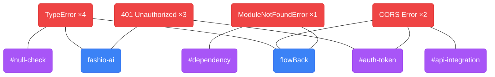

# FlowBack

> Pick up exactly where you left off.

FlowBack is a developer productivity tool that saves your coding context before a break and brings you back up to speed instantly when you return. It tracks errors across projects, detects recurring patterns, and visualizes skill gaps — all from your terminal.

---

## How it works

```
Before break          After break           When errors hit
─────────────         ────────────          ────────────────
flowback pause        flowback resume       flowback error "..."
      │                     │                      │
      ▼                     ▼                      ▼
Scans recently      Shows per-project       Root cause + fix
modified files      AI briefing:            steps. Detects if
across projects     goal, stuck point,      you're hitting the
                    next 3 steps, tags      same error again
```

---

## Install

```bash
git clone https://github.com/gitkkarthik/FlowBack.git
cd FlowBack
pip install -e .
```

Create `~/.flowback/.env` with your API key. FlowBack works with any LLM provider via [litellm](https://docs.litellm.ai/docs/providers):

**Google Gemini** (free tier available — recommended)
```
LLM_MODEL=gemini/gemini-2.5-flash
LLM_API_KEY=your_gemini_key
```
→ Get a free key at [aistudio.google.com](https://aistudio.google.com/app/apikey)

**OpenAI**
```
LLM_MODEL=gpt-4o
LLM_API_KEY=your_openai_key
```

**Anthropic Claude**
```
LLM_MODEL=claude-3-5-sonnet-20241022
LLM_API_KEY=your_anthropic_key
```

**Groq** (fast + free tier)
```
LLM_MODEL=groq/llama-3.1-70b-versatile
LLM_API_KEY=your_groq_key
```

**Ollama** (fully local — no API key needed)
```
LLM_MODEL=ollama/llama3
LLM_API_BASE=http://localhost:11434
```

That's it. No server to run. Works from any terminal.

---

## CLI Usage

### `flowback pause` — save context before stepping away

```bash
flowback pause ~/projects/myapp
flowback pause ~/projects/myapp ~/projects/other     # multiple projects at once
flowback pause ~/projects/myapp --note "debugging auth middleware, getting 401s"
```

### `flowback resume` — pick up where you left off

```bash
flowback resume          # latest session
flowback resume --all    # all past sessions
```

Each project gets its own AI briefing:

```
─────────────── Session #18  2026-03-15 11:49  ───────────────

╭─ fashio-ai — Goal ──────────────────────────────────────────╮
│ Building AI-powered fashion virtual try-on with image       │
│ processing and Supabase storage integration.                │
╰─────────────────────────────────────────────────────────────╯
╭─ Stuck point ───────────────────────────────────────────────╮
│ Client-side cropped images not returning public URLs        │
│ from Supabase for AI service consumption.                   │
╰─────────────────────────────────────────────────────────────╯
╭─ Next steps ────────────────────────────────────────────────╮
│ 1. Debug ensurePublicUrl in src/lib/ai-service.ts           │
│ 2. Add error logging to upload pipeline                     │
│ 3. Test with small static images first                      │
╰─────────────────────────────────────────────────────────────╯
  #file-upload  #supabase-storage  #api-integration
```

### `flowback error` — track errors and break loops

```bash
# Paste an error directly
flowback error "TypeError: Cannot read properties of undefined"

# Pipe from any command
npm run build 2>&1 | flowback error
python manage.py migrate 2>&1 | flowback error

# See all tracked errors with occurrence counts
flowback errors
```

| Occurrences | Response |
|---|---|
| 1st time | Root cause + 3 fix steps + prevention tip |
| 2nd time | ⚠ "Seen twice — watch this pattern" |
| 3rd+ time | 🔁 "You're in a loop!" + tailored break-the-loop advice |

### `flowback graph` — visualize skill gaps

```bash
flowback graph
```

Generates a self-contained HTML file and opens it in your browser — no server needed. Shows a force-directed graph of your errors, the projects they appeared in, and the skill areas they involve.



| Node | Color | Meaning |
|---|---|---|
| Error | 🔴 Red | A unique error type — size = how many times you've hit it |
| Project | 🔵 Blue | A project where errors occurred |
| Skill tag | 🟣 Purple | A skill area extracted from errors — size = how often it's involved |

- **Large red node** → recurring error, fix it properly
- **Red node linked to multiple blue nodes** → cross-cutting knowledge gap, not project-specific
- **Large purple node** → skill area to study

### `flowback tags` — browse skill tags

```bash
flowback tags
```

---

## Claude Code — MCP Integration

Connect FlowBack directly to Claude Code. Your context, errors, and skill gaps become Claude tools — available through natural language, no commands needed.

### Setup

```bash
# Register with Claude Code (one time)
claude mcp add flowback flowback-mcp
```

### Tools

| Tool | What it does |
|---|---|
| `resume` | Returns your last briefing so Claude has full context at session start |
| `pause` | Scans project folders and saves context |
| `track_error` | Analyzes an error, returns root cause + fix, detects loops |
| `skill_gaps` | Returns recurring patterns and skill areas to strengthen |

### Example prompts in Claude Code

```
"Resume my context from yesterday"
"I'm getting this error — track it and tell me the fix: [paste error]"
"What skill gaps am I building up?"
"Save my context for ~/projects/myapp before I take a break"
```

Claude calls the right tool automatically and returns the analysis inline.

---

## Web UI (optional)

A React/Vite browser interface is included for those who prefer a visual workflow. Requires both servers running.

```bash
# Terminal 1 — API server
cd backend
python3 -m venv .venv && source .venv/bin/activate
pip install -r requirements.txt
uvicorn main:app --reload        # http://localhost:8000

# Terminal 2 — frontend
cd frontend
npm install
npm run dev                      # http://localhost:5173
```

Three tabs: **Pause** · **Resume** · **Graph**

---

## Project structure

```
FlowBack/
├── flowback/
│   ├── cli.py          # flowback CLI commands
│   ├── mcp_server.py   # Claude Code MCP tools
│   ├── capture.py      # file scanner
│   ├── database.py     # SQLite (~/.flowback/history.db)
│   ├── llm.py          # Multi-provider LLM integration (litellm)
│   └── models.py       # Pydantic models
├── backend/
│   └── main.py         # FastAPI server (web UI only)
├── frontend/           # React/Vite web UI (optional)
├── pyproject.toml      # pip package config
└── setup.py
```

---

## Stack

| Layer | Technology |
|---|---|
| AI | Any provider via litellm (Gemini, OpenAI, Claude, Groq, Ollama…) |
| CLI | Python, Typer, Rich |
| Graph | force-graph.js (self-contained HTML) |
| Storage | SQLite (`~/.flowback/history.db`) |
| MCP | Anthropic MCP SDK |
| Web UI (optional) | FastAPI, React 18, Vite, Tailwind CSS |

---

## Notes

- All data stays local — the only thing that leaves your machine is file snippets sent to your configured LLM for analysis. With Ollama, nothing leaves your machine at all.
- Scans up to 5 recently modified files per folder within the last 2 hours, skipping binaries, `node_modules`, `.git`, and build output.
- History is stored at `~/.flowback/history.db` — shared between the CLI, MCP server, and web UI.
- The **Choose folder** button in the web UI is macOS-only (`osascript`). On other platforms type the path manually.
